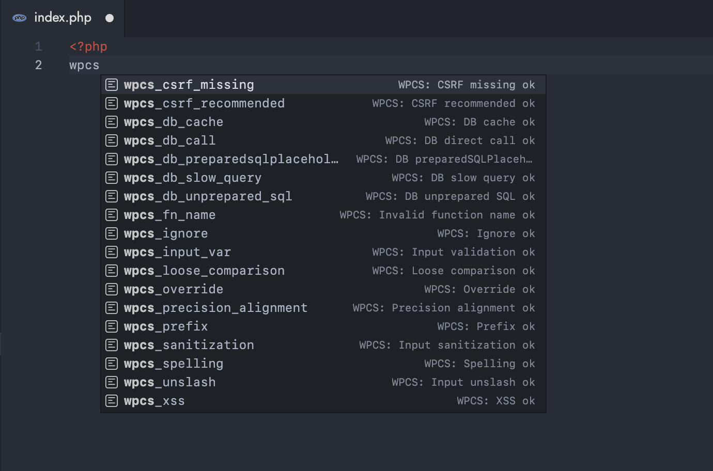

# WPCS Whitelist Flags Version 2

This extension for Visual Studio Code adds all [WordPress Coding Standards whitelist flags](https://github.com/WordPress-Coding-Standards/WordPress-Coding-Standards/wiki/Whitelisting-code-which-flags-errors) as snippets.

Extension is originally developed by [Claudio Sanches](https://github.com/claudiosanches/vscode-wpcs-whitelist-flags) but there were some issues and extension wasn't being maintained to so I modified and fixed the issues.

Originally Developed by [Claudio Sanches](https://github.com/claudiosanches/vscode-wpcs-whitelist-flags)

## License

[GPLv3](https://raw.githubusercontent.com/vijayhardaha/vscode-wpcs-whitelist-flags/master/LICENSE)
